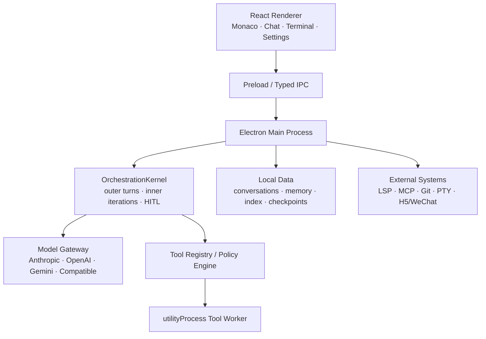

# 星构 Astra

<p align="center">
  
</p>

<p align="center">
  面向本地工作区的 AI 驱动桌面编辑器与智能体运行平台
</p>

<p align="center">
  <a href="https://github.com/YNchenzhu/-Astra/actions/workflows/ci.yml"></a>
</p>

星构 Astra 基于 Electron、React、Vite 和 TypeScript 构建，将代码编辑、终端、语言服务器、模型调用、工具执行、多智能体协作、工作包和本地检索放在同一个桌面应用中。项目内部包名为 `astra`，当前源码版本为 `0.5.0`。

> 项目说明：Astra 支持智能体工作包的创建、文件导入/导出和激活切换，因此也可承载写作、研究、办公等非编程领域的智能体配置。作者不是专业程序员，目前无力承诺持续开发与长期维护；本仓库更适合作为可研究、可验证的实验性工程，欢迎社区在充分测试后继续完善。

## 当前状态

本 README 按当前公开仓库源码重新核验，不把设计文档、预留接口或本地未公开资产写成已经交付的能力。

| 项目 | 当前事实 |
| --- | --- |
| 应用版本 | `0.5.0` |
| Node.js | `>= 22.12.0`；建议使用与 CI 一致的 Node 24 |
| 前端 | React 19.2、Vite 8.0、TypeScript 5.9、Monaco Editor |
| Electron | 开发依赖为 Electron 43；`electron-builder.json` 仍固定 Electron 41.1.0。在二者统一并重测前，完整安装包不能视为可复现发布物 |
| 自动检查 | GitHub Actions 执行类型检查、ESLint 和 Vitest |
| 安装包 | 配置了 Windows NSIS、macOS DMG、Linux AppImage，但 CI 不构建安装包 |
| 本地向量模型 | 配置和 tokenizer 已公开；约 570 MB 的 `model.onnx` 不在 Git 中。桌面界面仍可启动，但本地向量模式不可用 |
| 许可证 | 当前仓库没有 `LICENSE` 文件，公开可见不等于已经授予复制、修改或再分发许可 |

下文“已实现”仅表示当前公开源码中存在对应运行链路、界面或测试，不代表所有操作系统和外部服务均完成生产验证；需要额外资产或配置的能力会单独标明。

## 源码已实现的核心能力

### AI 与编排

- 统一接入 Anthropic、OpenAI Chat、OpenAI Responses、Gemini、AWS Bedrock、GCP Vertex AI、Azure Foundry，以及兼容 Anthropic/OpenAI 协议的第三方网关。
- 支持 Agent、Plan、Ask 三种聊天模式，并对计划模式和只读场景实施工具权限约束。
- 主聊天固定经过 `OrchestrationKernel`，由内核管理外层任务回合、内层 Agentic 迭代、暂停/恢复、检查点、持久化 Inbox、人在回路审批和终止结果。
- 支持流式工具调用、思考内容、上下文压缩恢复、过载重试、输出截断恢复、停滞和重复调用守卫。
- 支持子智能体、团队模板、任务状态、邮箱通信、后台任务和 Running Agents 可视化。

### 编辑器与工程工具

- Monaco 多标签编辑器、文件树、全文搜索、集成终端、命令面板、Diff 审计和撤销队列。
- 内置 TypeScript/JavaScript、Python、HTML/CSS/JSON 等语言服务器启动与诊断链路。
- 工具系统覆盖文件读取与编辑、Glob/Grep、Shell/PowerShell、LSP、网页访问、MCP、Notebook、Word/Excel、任务和团队协作等类别。
- MCP 管理器支持内置预设、自定义服务器、资源读取和工具注册；打包时可携带固定版本的 MCP 运行依赖。
- Skills 与插件系统支持发现、加载、权限过滤、工作区刷新和插件智能体接入。

### 工作包

工作包（Bundle）用于把一组角色、提示词、工具白名单、团队模板和执行策略组织成可切换配置。

- 内置“代码开发”“通用助手”“写作助手”三个预设工作包。
- 支持用户级、项目级、内置和外部导入四种来源。
- 支持新建、编辑、搜索、导入 JSON、导出 JSON、冲突处理和一键激活。
- 工作包切换会同步主智能体、子智能体与会话上下文，适合在不同业务领域之间复用 Astra。
- 当前只提供本地工作包画廊；远程社区市场仍是后续能力。

### 上下文、记忆与检索

- 对话按工作区持久化，并提供上下文预算、压缩、附件召回和会话记忆提取。
- 本地向量检索代码使用 bge-m3 ONNX 模型，配合工作区索引和文件变更监听；必须另行安装 `model.onnx`，或在 `auto`/`cloud` 模式配置云端 Embedding 服务。
- 支持 PDF、Office 文档、图片和文本附件的解析与预览。
- 模型上下文窗口由统一 Provider Registry 管理，也可在设置中覆盖。

## 文件编辑安全机制

Astra 的 `edit_file` 和 `multi_edit_file` 不是无条件覆盖文件，而是执行“先读后改”的快照校验：

1. `read_file` 为文件生成 `readId`。
2. `readId` 与目标路径绑定，读取 A、B 两个文件时必须分别保存两个映射。
3. 编辑时传入同一路径最新的 `baseReadId`，工具会校验读到的字节快照、编辑区域和文件状态。
4. 每次成功编辑都会轮换出新的 `readId`，后续编辑必须使用最新回执。
5. 主机在工具摘要中重新注入“路径 → readId”映射，降低多文件并行读取后串用回执的概率。
6. 多项同文件修改可一次交给 `multi_edit_file`，整批成功后只轮换一次回执。

文件写入还叠加了路径沙箱、逐文件锁、原子写入、写入完整性检查和 DiffTransaction WAL。打包版本默认把读写、搜索和网页工具转发到 Electron `utilityProcess`；工具进程崩溃时，进行中的调用会返回结构化错误，下一次调用可重新拉起进程。

## 远程访问能力边界

| 能力 | 当前公开源码状态 | 使用条件 |
| --- | --- | --- |
| 桌面端 AI 编辑器 | 已实现 | 安装依赖并配置模型 |
| H5 浏览器聊天 | 已实现服务、鉴权、限流和前端连接层 | 需要在设置中启用并正确配置网络 |
| 微信远程 Adapter | 已包含 `adapters/wechat` | 需要 Bun、微信凭据、配对和单独启动 Adapter |
| 钉钉、Telegram、飞书 Adapter | 当前公开仓库未包含对应运行时代码 | `adapters/README.md` 中的旧说明不能作为可运行依据 |

远程访问会扩大攻击面。不要把 H5 服务直接暴露到公网；应使用强令牌、配对/允许名单、可信反向代理和网络访问控制。

## 系统架构



主聊天的实际入口链路为：

```text
renderer send
  -> electron/ai/streamHandler.ts
  -> runOrchestratedMainChat(...)
  -> OrchestrationKernel.runDriveMainChat(...)
  -> driveInnerLoop(...)
  -> model stream / tool runtime / policy / persistence
```

## 快速开始

### 环境要求

- Node.js `>= 22.12.0`，建议 Node 24
- npm
- Git
- Windows、macOS 或 Linux 源码目标环境；当前公开 CI 只在 Ubuntu 上执行静态检查和单元测试

### 安装与运行

```bash
git clone https://github.com/YNchenzhu/-Astra.git astra
cd astra
npm ci
npm run electron:dev
```

应用启动后，在“设置”中添加模型服务和 API Key，再打开一个可信工作区。密钥和本机路径不应写入源码、示例或提交记录。

### 常用检查

```bash
npm run typecheck
npm run lint
npm run test
npm run build
```

本仓库使用 TypeScript Project References。不要使用裸 `tsc` 或 `tsc --noEmit`；应使用 `npm run typecheck`（即 `tsc -b`）。

### 首次运行验收

建议用最小闭环判断环境是否正常：

1. 启动应用并打开一个不含敏感信息的测试目录。
2. 在“设置”中选择一个 Provider，填写该服务商提供的模型名、Base URL（如需要）和 API Key。
3. 发起一次纯问答，再让 Agent 只读打开测试目录中的一个文本文件；确认模型响应、工具卡片和 `readId` 回执均正常显示。
4. 需要本地检索时，再在 Embedding 设置中安装本地模型；缺少 `model.onnx` 不影响基础聊天和编辑器启动，但 `local` 模式会返回“未安装本地模型”。`auto` 模式只有在配置了云端 Embedding 时才能回退。

常见启动问题：Electron 二进制下载失败通常与网络或代理有关；原生依赖异常时应切换到 Node 24 后重新执行 `npm ci`；能启动但不能对话时，优先检查 Provider、模型名、Base URL 和密钥；H5 无法监听时，检查端口占用和访问策略。

## 模型配置

Provider Registry 当前包含以下接入类型：

- Anthropic 原生接口
- OpenAI Chat Completions
- OpenAI Responses API
- Gemini 原生接口
- AWS Bedrock、GCP Vertex AI、Azure Foundry
- 阿里云百炼、MiniMax、智谱 GLM、Kimi、DeepSeek
- 自定义兼容接口

具体模型 ID、上下文窗口和第三方接口兼容性会变化。请以服务商当前文档为准，并在设置中核对 Base URL、模型名、区域、项目 ID 和认证方式。Astra 不附带任何商业模型额度或 API Key。

## 安全与隐私

- 文件系统和终端 IPC 以已打开的工作区根目录为边界，拒绝越界路径。
- 工作区信任默认是兼容旧版本的 `legacy` 模式，首次打开可自动信任；`strict` 模式要求显式加入信任列表。处理陌生仓库时应启用 `strict`。
- Shell 和 PowerShell 命令经过只读识别、危险模式检查和权限决策。
- 渲染进程文本、MCP 配置和远程输入设有独立校验与清洗。
- API Key 优先通过 Electron `safeStorage` 使用系统密钥能力加密后落盘。
- 如果操作系统无法提供 `safeStorage`，当前实现会回退为明文存储并记录警告；此时不要在共享机器上保存密钥。
- 发送给模型的提示词、附件摘要、文件片段和工具结果可能离开本机并由所选第三方服务商处理；使用前应核对服务商的数据政策。
- MCP 服务、插件、Skills、Shell 和 PowerShell 可能执行代码、访问网络或调用外部系统。只安装可信来源，并逐次核对高风险权限。
- 恶意仓库内容、附件或远程消息可能包含提示词注入。路径沙箱和权限规则不能替代人工确认，不应让 Agent 在未知项目中无监督执行写入或命令。
- `safeStorage` 主要保护设置中的密钥，不代表会话、索引、日志、附件和工作包整体加密。
- 会话、记忆、索引、日志、用户级工作包和远程附件属于本机运行数据，不应提交到公开仓库；项目级工作包只有在确认不含密钥、个人信息和内部提示词后才适合纳入版本控制。
- `.gitignore` 已排除真实 `.env` 文件及其本机变体、`.agents/`、`.claude/`、`.cursor/`、`.codex/`、运行日志、构建产物和本地模型二进制（`.env.example` 模板除外），但提交前仍应人工复核。
- 桌面数据主要保存在 Electron `userData` 目录，IM Adapter 另使用用户配置目录；当前卸载配置不会自动删除应用数据，共享或转让设备前应手动检查和清理。

## 项目结构

```text
src/
  components/              React UI：编辑器、聊天、终端、设置、工作包
  stores/                  Zustand 状态与会话持久化
  services/                Renderer 服务与 Electron API 封装

electron/
  ai/                      模型客户端、流式响应、Agentic Loop
  orchestration/           编排内核、策略、检查点、HITL、工具运行时
  agents/                  智能体、团队、子智能体、工作包
  tools/                   工具注册、权限、文件安全、Worker 执行
  diff/                    DiffTransaction、WAL、Watcher、Undo
  lsp/                     语言服务器管理
  mcp/                     MCP 管理与传输
  memory/ context/         记忆、召回和上下文预算
  embedding/               ONNX 向量模型与工作区索引
  security/ settings/      工作区信任、路径策略和密钥落盘
  h5/                      H5 服务与微信接入配置
  plugins/ skills/         插件和 Skill 生命周期

adapters/
  common/                  IM 公共协议、配对、会话和附件逻辑
  wechat/                  当前公开的微信 Adapter

bundled-lsp/               打包时安装的固定版本语言服务器
bundled-mcp/               打包时安装的固定版本 MCP 预设
resources/embeddings/      bge-m3 配置与 tokenizer
e2e/                      Electron Playwright 端到端测试
```

## 开发命令

| 目的 | 命令 | 说明 |
| --- | --- | --- |
| Electron 开发模式 | `npm run electron:dev` | 启动 Vite 并打开真实 Electron 窗口 |
| 类型检查 | `npm run typecheck` | 使用 `tsc -b` |
| ESLint | `npm run lint` | 检查整个仓库 |
| 单元测试 | `npm run test` | 等价于 `vitest run`；CI 另加 GitHub Actions reporter |
| 单文件测试 | `npx vitest run <file>` | 适合局部回归 |
| Renderer/Main 构建 | `npm run build` | 生成 `dist/`、`dist-electron/` 和 Adapter |
| E2E 构建 | `npm run build:e2e` | 注入仅测试环境可用的 hooks |
| E2E 测试 | `npm run test:e2e` | 会启动真实 Electron 窗口 |
| Tool Worker E2E | `npm run test:e2e:worker` | 强制启用工具进程路径 |
| 完整安装包 | `npm run electron:build` | 安装打包依赖、校验资产并调用 electron-builder |

## 测试与 CI

GitHub Actions 当前在 Ubuntu + Node 24 上执行：

1. `npm ci`
2. 安装 Electron 平台二进制
3. `npm run typecheck`
4. `npm run lint`
5. `npx vitest run`

CI 不运行 Electron Playwright E2E，也不构建安装包。因此“CI 通过”表示静态检查和单元测试通过，不等同于 Windows/macOS/Linux 安装包均已验证。

## 打包前置条件

`npm run electron:build` 会先安装 `bundled-lsp` 和 `bundled-mcp` 的固定版本依赖，并运行 `scripts/assertPackagingAssets.mjs`。完整打包还要求：

- `resources/embeddings/bge-m3/model.onnx` 已放置到本地；该文件约 570 MB，不在 Git 中。
- `tokenizer.json`、`config.json` 和工具 Worker 等构建产物完整。
- Electron 开发依赖与 `electron-builder.json` 的 `electronVersion` 已统一。
- Windows 正式分发前配置有效代码签名；当前配置没有强制签名。

## 已知限制

- 项目仍处于实验性开发阶段，源码中保留了迁移期注释、兼容层和部分过时文档。
- `adapters/README.md` 描述了尚未随当前公开仓库提供的钉钉、Telegram、飞书目录，使用时应以实际文件为准。
- 本地向量模型二进制和安装包不随 Git 仓库提供。
- E2E 需要可显示真实 Electron 窗口的桌面环境。
- 仓库尚未提供正式发布流程、版本迁移承诺和兼容性矩阵。

## 参与改进

提交修改前，至少运行：

```bash
npm run typecheck
npm run lint
npm run test
```

涉及打包、工具 Worker、文件编辑、权限或 H5/IM 的修改，还应补充对应的局部测试与真实环境验证。请勿提交 API Key、Cookie、访问令牌、个人路径、聊天记录、本地记忆、环境文件、日志、模型二进制或构建产物。

## 许可证

当前仓库尚未附带开源许可证。在许可证明确之前，代码仅为公开可见；如需复制、修改、再分发或用于商业项目，请先获得权利人明确授权。
